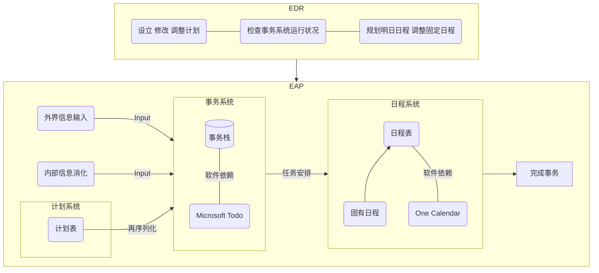

---

title: 大学生涯基本框架
categories: 哲学
classes: wide
---

>  大学生涯是一段充满了迷茫与挑战的旅程。一方面，我们进入大学是为了学习专业知识，发掘自己未来的发展方向；另一方面大学也是中国社会激烈竞争的缩影，是理想与现实矛盾的交汇点。在这一过程中，我们对于自我的认知，以及对社会的认知前所未有地变化着，我们生活在各种矛盾之中，痛苦而欢乐着，我们会错失良机，我们会迷失方向，我们也会寻求机遇与挑战。因此，只有通过哲学性的思考以及归纳性的反思，才能够更好地认识自我，认识社会，寻找生活的和谐与智慧。

# 大学生涯中亟需解决的几个核心问题

1. 学习问题：学习是为了什么，应该如何学习，如何平衡学习的功利性与理想性
2. 事务处理与规划能力：如何妥善地处理事务，如何规划日程与管理时间，如何安排计划以实现自己的目标
3. 作息与健康问题：如何保持睡眠规律，如何提高身体素质，如何保持健康
4. 娱乐问题：如何保持娱乐与工作的平衡
5. 社交问题：如何看待社交，如何妥善处理与他人的关系，如何寻求友情与爱情
6. 表达能力：如何锻炼表达能力、沟通能力、交流效率。

# 构建大学生涯基本框架

- 目标：合理地解决以上几个核心问题
- 基本内容：四大系统（事务、日程、计划系统【核心系统】，作息系统，学习系统，健康系统），三项原则。

## 核心系统：事务(event)、日程(arrangement)、计划(plan)系统 

> 事务(event)、日程(arrangement)、计划(plan)系统，简称「EAP系统」，是该框架的核心系统。

该系统的目标在于理顺代办事务，安排日程，以及合理筹划并执行计划。

「事务（event）」即一系列待办事项。例如各种活动安排、工作安排、学习任务等。事务组成了一个人的主要任务，是简单的备忘录，是安排日程的主要原材料，是计划的最终实现过程。可以说事务是一切的核心与源头。大学生涯基本框架的最终目的便可以理解为完美地完成事务。

「日程(arrangement)」即对每日的时间安排(arrange)与任务分配(assign)。日程可以更好地管理时间，完成事务。

「计划」即围绕某一特定目标，对未来事务进行规划。计划必须要有特定的目标，还需要有大致的实现步骤。由计划产生事务，并最终完成的这一过程被称为「再序列化(re-serialization)」。

该系统还拥有EDR（即每日例程），用来动态地管理该系统的运行状况。

